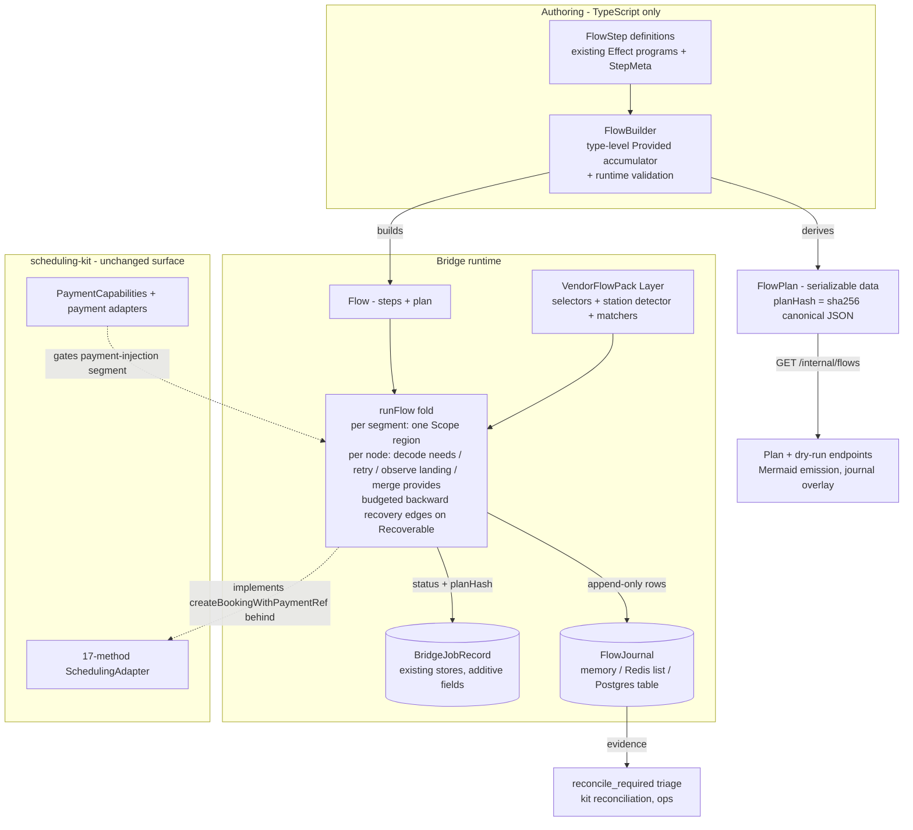

# Flow DAG Formalization (TIN-1993)

Status: proposed. Owner: bridge. Scope: bridge `src/flow/`, `src/server/` decomposition, store
extensions, vendor abstraction; kit changes are type-only graduations, deferred and explicit.

Provenance: synthesized from three competing designs (`effect-native`, `graph-as-data`,
`incremental-strangler`) judged by a three-judge panel; majority winner `effect-native`. Every
agreed graft is absorbed; every identified fatal flaw is eliminated; disagreements are recorded
in Appendix B.

## 1. Motivation & vision

A scheduler client flow — date picking, intake forms, SOAP notes, payment panels, confirmation —
IS a DAG of abstractable functions, and the bridge must represent it as one. The bridge abstracts
scheduler *logic* monadically, agnostic of the scheduling backend. Acuity exists today as a rough
MVP; CalCom, GlossGenius, and Vagaro are named future lanes (the schedule-kit instance-model
backend enum: `homegrown|acuity|calcom|glossgenius|vagaro|manual|external-url`).

Two properties are constitutional:

- **Fuzzy-in**: actions tolerate imprecise inputs — services, dates, intake fields match with
  explicit confidence scores and audit trails, because browser automation targets surfaces a
  vendor (or a tenant editing their intake form) can change at any time.
- **Fuzzy-out**: actions observe where the flow *actually landed* versus where it intended to
  land, and the flow representation branches on that observation instead of assuming success.

Vendor-unsupported payment injection (Venmo via 100% coupon bypass plus kit payment adapters)
must be a first-class DAG segment, not an Acuity hack.

Settled constraints this design does not violate: the three-repo contract (bridge owns
automation/protocol/runtime truth; scheduling-kit owns the 17-method `SchedulingAdapter`
contract, payment adapters, `PaymentCapabilities`; apps are adopters); the bridge runtime (HTTP
server + async `BridgeJobCommand`/`BridgeJobRecord` job queue over memory/Redis/Postgres stores
+ `AvailabilitySnapshot` freshness semantics + Redis SETNX single-flight — the published paper's
O(1) primitive, and nothing in this design sits between a request and it); Effect ^3.19 as the
composition substrate; Bazel `//:pkg` as artifact truth with pnpm publishing; production on K8s
RKE2, 4 replicas, tailnet-only.

## 2. Current state

The execution substrate is already right; the formal representation is missing.

**Steps are already Effect programs.** Every Acuity step is
`(params) => Effect<Result, WizardStepError, BrowserService | Scope>` with `Data.TaggedError`
errors: `navigateToBooking` (`src/adapters/acuity/steps/navigate.ts:67`), `fillFormFields`
(`fill-form.ts:53`), `bypassPayment` (`bypass-payment.ts:54`), `submitBooking` (`submit.ts:31`),
`extractConfirmation` (`extract.ts:37`), `readAvailableDates` (`read-availability.ts:50`),
`readTimeSlots` (`read-slots.ts:46`), `readDatesViaUrl`/`readSlotsViaUrl`
(`read-via-url.ts:425,500`), `extract-business.ts`.

**The booking DAG exists in three divergent hand-written copies** with no shared formal
representation:

1. `wizard.ts:88-143` (`createBookingWithPaymentRefProgram`) — one `Effect.scoped` region around
   the whole program.
2. `handler.ts:1843-1859` — inline `Effect.gen` over the `acuitySteps` table.
3. `server/worker.ts:268-325` (`createAcuityBridgeJobExecutor`) — adds the payment-bypass proof
   (`assertPaymentBypassProven`, `server/worker.ts:151-167`) and the `reconcile_required`
   boundary the other two lack, and — critically — wraps **each step** in its own
   `Effect.scoped + Effect.provide(BrowserSessionLive)` (`runWizardStep`,
   `server/worker.ts:140-149`), where `BrowserSessionLive` opens a fresh page per scope
   (`shared/browser-service.ts:234-296`): different page-lifecycle semantics than `wizard.ts`.
   This latent divergence is the bug class this design makes structurally inexpressible.

**Fuzzy-in exists in fragments**: substring service matching (`navigate.ts:52-56`); a
built-but-unwired 4-strategy `ServiceResolver` confidence cascade
(`service-resolver.ts:24-121,312-385`); selector fallback chains (`selectors.ts:34-197`);
required-textarea label inference (`fill-form.ts:234-266`). **Fuzzy-out exists in fragments**:
`NavigateResult.landingStep` (`navigate.ts:40-47`, probed by `detectLandingStep`
`navigate.ts:521-536`); `waitForAvailabilitySurface` returning `'calendar'|'time-list'`
(`read-via-url.ts:49`); bypass body-text `$0` verification (`bypass-payment.ts:155-165`);
submit's 4-signal confirmation race (`submit.ts:99-168`); extract's triple-probe + regex
fallback (`extract.ts:43-64,149-164`).

**The async layer is the durable substrate**: `BridgeJobRecord`/`BridgeJobStatus` (incl.
`reconcile_required`, today's only encoding of "crossed the point of no return with unknown
outcome", `src/async/types.ts:13-20,103-116`), `BridgeAsyncStore` with three implementations
(`store.ts:14-45`, `redis-store.ts`, `postgres-store.ts`), `AvailabilitySnapshot` freshness
(`types.ts:118-130`), Redis SETNX single-flight (`shared/redis-l2.ts:75-101`,
`bridge-read-cache.ts:129-136`, `redis-store.ts:233-273`).

**Known debts this design pays down**: the mutable `acuitySteps` `Object.assign` test seam
(`handler.ts:147-165`); bridge Context tags mis-namespaced `scheduling-kit/*`
(`service-resolver.ts:47`, `shared/browser-service.ts:71,81`); MassageIthaca tenant leakage in
the "generic" selector registry (`selectors.ts:101-123`, `fill-form.ts:88`);
`BridgeAdapterProfile.backend` pinned to literal `'acuity'` (`async/types.ts:30`); the
2756-line `handler.ts` monolith.

## 3. Design overview

Steps stay Effects. The flow is authored once through a typed builder; the DAG is a serializable
**projection derived from the same definitions that execute** — no second source of truth to
drift, no interpreter language, no JSON authoring front door. Execution is a single fold.
Checkpoints are append-only rows in a separate keyspace riding the existing store
implementations. Segments are explicit Scope regions. Vendors are Layers.



What this is *not*: not a workflow engine, not a graph interpreter over a JSON IR, not
browser-state resume. The single concession to "DAG as data" is the `FlowPlan` projection.

## 4. Core types

All new code in bridge `src/flow/`. `Schema` is `effect/Schema`; zero new runtime dependencies.

```ts
// src/flow/state.ts
import { Context, Effect, Schedule, Schema } from 'effect';

/** Durable flow state: plain-data, JSON-encodable schemas ONLY. Volatile handles (Page,
 * ElementHandle) live in R (Context services), never in state. This is a convention with
 * layered enforcement, NOT a structural impossibility — `Schema.declare`/`Schema.Any` can wrap
 * arbitrary runtime values (an ElementHandle included). Fences: (a) `JsonEncodableSpec` rejects
 * schemas whose Encoded side is not `JsonValue`; (b) the §11 state-schema conformance test;
 * (c) an ESLint ban on `Schema.declare`/`Schema.Any` in flow-state positions (catches the
 * `any`-typed escapes that slip past (a)). */
export type JsonValue =
  | string | number | boolean | null
  | readonly JsonValue[]
  | { readonly [key: string]: JsonValue };
export interface FlowStateSpec {
  readonly [key: string]: Schema.Schema<any, any, never>;
}
export type JsonEncodableSpec<Spec extends FlowStateSpec> = {
  readonly [K in keyof Spec]: Schema.Schema.Encoded<Spec[K]> extends JsonValue ? Spec[K] : never;
};
export type StateOf<Spec extends FlowStateSpec> = {
  readonly [K in keyof Spec]: Schema.Schema.Type<Spec[K]>;
};

// src/flow/station.ts — vendor-namespaced landing vocabulary (fuzzy-out)
export type BridgeBackend = 'acuity' | 'calcom' | 'glossgenius' | 'vagaro';
export type StationId = `${BridgeBackend}:${string}`; // 'acuity:client-form'

export interface StationEvidence {
  readonly kind: 'selector' | 'url' | 'text';
  readonly key: string;          // SelectorRegistry key or url-pattern id
  readonly matched: boolean;
}
export interface LandingObservation {
  readonly expected: readonly StationId[];   // from StepMeta.expects
  readonly observed: StationId | 'unknown';
  readonly confidence: number;               // 0..1 detector confidence
  readonly evidence: readonly StationEvidence[];
}
export type LandingOutcome =
  | { readonly _tag: 'OnTrack'; readonly landing: StationId }
  | { readonly _tag: 'Recoverable'; readonly landing: StationId;
      readonly rerouteTo: string }           // must name a declared RecoveryEdge.to (§4 plan.ts)
  | { readonly _tag: 'Diverged'; readonly observation: LandingObservation };

// src/flow/fuzzy.ts — fuzzy-in: tolerant matching with confidence. Pure scorers reused
// verbatim from service-resolver.ts:57-121 (normalize/tokenOverlap/levenshtein/fuzzyConfidence).
export interface FuzzyResolution<A> {
  readonly value: A;
  readonly confidence: number;   // 0..1
  readonly strategy: 'id-match' | 'normalized-exact' | 'token-overlap' | 'fuzzy';
  readonly matchedLabel: string;
  readonly threshold: number;    // policy that admitted the match
  readonly alternates: readonly { readonly label: string; readonly confidence: number }[];
}
export interface FuzzyMatcher<Q, A> {
  readonly threshold: number;
  readonly match: (query: Q, candidates: readonly A[]) =>
    Effect.Effect<FuzzyResolution<A>, FuzzyMatchError>;
}
export class ServiceMatcher extends Context.Tag('scheduling-bridge/ServiceMatcher')<
  ServiceMatcher,
  FuzzyMatcher<{ serviceName: string; appointmentTypeId?: string }, { label: string; ref: string }>
>() {}
// DateMatcher (tolerant date/TZ normalization + slot membership) and FieldMatcher
// (intake-label inference generalizing fill-form.ts:234-266) are the same shape; all three
// ship as shared scoring MACHINERY, not declared-only metadata (judge-mandated; Appendix B).

// src/flow/step.ts
export type IdempotencyClass =
  | 'read'              // re-run freely
  | 'replayable-write'  // session-local; safe to re-drive on a fresh session
  | 'effectful-once';   // external point of no return (submitBooking)

export type StepTag = 'navigation' | 'mutation' | 'payment-injection' | 'extraction' | 'read';

export interface StepMeta<
  Spec extends FlowStateSpec,
  Needs extends keyof Spec & string,
  Provides extends keyof Spec & string,
> {
  readonly id: string;                       // 'acuity/navigate'
  readonly needs: readonly Needs[];          // typed input keys (edges in)
  readonly provides: readonly Provides[];    // typed output keys (edges out)
  readonly expects: readonly StationId[];    // fuzzy-out: acceptable landings
  readonly idempotency: IdempotencyClass;    // THE resume/retry gate driver
  readonly segment: string;                  // Scope region; one page session per segment
  readonly retry?: Schedule.Schedule<unknown, FlowStepError>;
  readonly tags: readonly StepTag[];
  readonly selectorKeys: readonly string[];  // selector-drift audit surface
}

export interface StepOutcome<Spec extends FlowStateSpec, Provides extends keyof Spec & string> {
  readonly state: Pick<StateOf<Spec>, Provides>;
  readonly observed?: LandingObservation;
  readonly resolutions?: readonly FuzzyResolution<unknown>[];
  readonly idempotencyToken?: string;        // e.g. generated coupon code
}

export interface FlowStep<
  Spec extends FlowStateSpec,
  Needs extends keyof Spec & string,
  Provides extends keyof Spec & string,
  E, R,
> {
  readonly meta: StepMeta<Spec, Needs, Provides>;
  readonly run: (input: Pick<StateOf<Spec>, Needs>) =>
    Effect.Effect<StepOutcome<Spec, Provides>, E, R>;
  /** Vendor-side cleanup only (e.g. admin-API cancel). NEVER payment refunds — kit's
   * pipeline owns those (kit src/core/pipelines.ts:89). */
  readonly compensate?: (output: Pick<StateOf<Spec>, Provides>) =>
    Effect.Effect<void, never, R>;
}

// src/flow/plan.ts — the serializable projection (derived, never authored)
export interface RecoveryEdge {
  readonly to: string;                       // target stepId; MAY point backward (re-entry)
  readonly maxReentries: number;             // journaled re-entry budget; default 1
}
export interface FlowPlanNode {
  readonly stepId: string;
  readonly needs: readonly string[];
  readonly provides: readonly string[];
  readonly dependsOn: readonly string[];     // forward edges (nodes providing my needs): acyclic
  readonly recoveries?: readonly RecoveryEdge[]; // recovery edges: may point backward, budgeted
  readonly expects: readonly StationId[];
  readonly idempotency: IdempotencyClass;
  readonly segment: string;
  readonly tags: readonly StepTag[];
}
export interface FlowPlan {
  readonly flowId: string;                   // 'booking_create_with_payment', ...
  readonly backend: BridgeBackend;
  readonly version: string;                  // semver of the flow shape
  readonly nodes: readonly FlowPlanNode[];   // topologically ordered by forward edges
}
// planHash = sha256(canonical JSON of FlowPlan); pinned into the job record at enqueue
// (additive fields planHash?, flowVersion? on BridgeJobRecord).

// src/flow/flow.ts — the single front door
export interface Flow<Spec extends FlowStateSpec, E, R> {
  readonly plan: FlowPlan;                   // derived, frozen
  readonly planHash: string;
  readonly steps: ReadonlyMap<string, FlowStep<Spec, any, any, E, R>>;
}
export declare const makeFlow: <Spec extends FlowStateSpec>(spec: Spec & JsonEncodableSpec<Spec>) =>
  FlowBuilder<Spec, never /* Provided */, never /* E */, never /* R */>;
// FlowBuilder.add(step) compiles ONLY if step.meta.needs ⊆ Provided ∪ keyof Initial; the same
// constraint, forward-edge acyclicity, and segment-contiguity are re-validated at runtime at
// construction. Forward edges (dependsOn) are the structural DAG of progress and MUST be
// acyclic. .recover(on: (state, observed) => stepId, edges) records `recoveries`: explicitly
// marked recovery edges that MAY point backward, each with a journaled re-entry budget
// (maxReentries, default 1); excluded from the acyclicity check, so the plan stays a DAG with
// annotated recovery edges and the executed trace is a finite unrolling, bounded in §5.
// There is NO JSON/IR authoring path; plans are output, never input.

// src/flow/journal.ts — append-only checkpoint rows, separate keyspace
export type CheckpointStatus =
  'started' | 'completed' | 'failed' | 'compensated' | 'skipped_resume' | 'rerouted';
export interface FlowCheckpoint {
  readonly operationId: string;              // = BridgeJobRecord.operationId
  readonly seq: number;                      // monotonic per operation
  readonly flowId: string;
  readonly flowVersion: string;
  readonly planHash: string;
  readonly stepId: string;
  readonly attempt: number;
  readonly status: CheckpointStatus;
  readonly at: string;                       // ISO
  readonly landing?: LandingObservation;
  readonly resolutions?: readonly FuzzyResolution<unknown>[];
  readonly stateDelta?: Record<string, unknown>; // Schema-encoded Provides; segment
                                                 // boundaries only; redaction-annotated
  readonly idempotencyToken?: string;
  readonly reroute?: { readonly to: string; readonly remaining: number }; // on 'rerouted' rows
  readonly error?: { readonly code: string; readonly message: string; readonly retryable: boolean };
}
export class FlowJournal extends Context.Tag('scheduling-bridge/FlowJournal')<
  FlowJournal, {
    readonly append: (cp: Omit<FlowCheckpoint, 'seq'>) => Effect.Effect<FlowCheckpoint, JournalError>;
    readonly read: (operationId: string) => Effect.Effect<readonly FlowCheckpoint[], JournalError>;
  }
>() {}

// src/flow/outcome.ts — whole-flow fuzzy-out
export interface FlowOutcome<O> {
  readonly output: O;
  readonly landed: 'intended-terminal' | 'alternate-terminal' | 'compensated';
  readonly terminalStepId: string;
  readonly confidenceFloor: number; // min accepted fuzzy-in confidence on executed path
}
```

Storage layout (eliminates the embedded-array clobber hazard: the Redis store round-trips whole
`BridgeJobRecord` JSON, so an embedded journal array would be read-modify-write under
lease-expiry races): memory — per-operation array, trivially serial; Redis — one atomic Lua
script per append that derives `seq = LLEN bridge:flow:journal:{operationId}` and `RPUSH`es the
seq-stamped row in the same atomic step (a separate `INCR` seq counter would let two workers
interleave under exactly the lease-expiry race above — list order diverging from seq, duplicate
attempt rows), with TTL coupled to a retention knob rather than job-record TTL; Postgres —
additive `flow_checkpoints` table whose `PRIMARY KEY (operation_id, seq)` gives the same
guarantee declaratively. `BridgeJobRecord` gains only scalar additive fields (`planHash?`,
`flowVersion?`); the journal is never embedded in the record.

## 5. Execution semantics

**Plan vs execute.** `flow.plan` is computed once at construction. `GET /internal/flows` serves
all registered plans (auth-gated like existing `/internal/*` routes).
`POST /internal/flows/:flowId/plan` is a browser-free dry-run: it executes only *plan-safe*
resolution — fuzzy service match against `shared/acuity-service-catalog.ts` with confidence,
snapshot freshness classification under existing `observedAt/staleAt/expiresAt` semantics — and
returns the `FlowPlan`, resolutions, and warnings ("path navigate→fill→bypass→submit, service
matched 0.95 normalized-exact, slots snapshot stale"). No write-class node runs in plan mode.

**The fold.** `runFlow(flow, initial)` (~100 lines, the only combinator):

1. Group plan nodes by `segment`. For each segment, open one Scope region and provide
   `BrowserSessionLive` (or the vendor's session layer) once — one page session per segment, by
   construction. Segment scoping is declared in `StepMeta.segment`, machine-enforced by the
   runner, and conformance-tested against the production worker path — the verified
   `wizard.ts`-vs-worker scoping divergence becomes inexpressible.
2. Per node: decode `needs` from accumulated state; journal `started` (with `idempotencyToken`
   when the step mints one); run with `Effect.retry(meta.retry ?? Schedule.stop)`; compare
   `observed` vs `expects` → `LandingOutcome`; journal `completed`/`failed`; merge `provides`.
3. `Recoverable` reroutes along a declared recovery edge (targets are data; choosers are typed
   code). Recovery edges may point backward — the motivating case: navigate expects
   `acuity:client-form`, lands on `acuity:service-selection`, recovery re-enters
   `acuity/navigate`. Each traversal journals a `rerouted` row (edge + remaining budget) and
   decrements that edge's `maxReentries`; exhaustion escalates to `Diverged`. The fold
   terminates: total step executions ≤ |nodes| × (1 + Σ `maxReentries` over recovery edges);
   the executed trace is a finite unrolling of the forward-acyclic plan. `Diverged` fails with
   the observation attached; `confidenceFloor` accumulates.

**Checkpoint persistence discipline** (evidence before control state):

- Booking jobs: appends are awaited (they already run behind the async queue; no
  request-latency tax).
- Availability/read flows: fire-and-forget with a sampling knob (`BRIDGE_FLOW_JOURNAL_SAMPLE`);
  the Redis SETNX single-flight and snapshot freshness paths never pay checkpoint latency —
  journal writes happen inside job execution, never between request and the L2 primitive.
- While the journal is evidence-only (0.6.x), append failure is log-and-continue: a failed
  checkpoint write never fails a booking. When resume promotes journal data to control state
  (0.7.0), booking-path appends become mandatory.

**Idempotency.** Three classes drive every gate:

- `read`: re-run freely.
- `replayable-write`: session-local writes (navigate, fill-form, apply-coupon). Safe to re-drive
  on a fresh session — their effects died with the page. A retried payment-injection segment
  reuses the journaled `idempotencyToken` (the coupon code from `generateCouponCode`,
  `bypass-payment.ts:212`) instead of minting another.
- `effectful-once`: external point of no return (`submitBooking`, `submit.ts:31`). A `started`
  checkpoint without `completed` on an `effectful-once` step hard-maps the job to the existing
  `reconcile_required` status (`async/types.ts:19`) — never silent re-submit. Resume of a
  booking flow first runs a cheap `extractConfirmation` probe: confirmation found ⇒ `succeeded`;
  ambiguous ⇒ `reconcile_required` with the step trace, landing observation, and evidence
  attached. The journal makes today's coarse status *explainable* (which step, what landing,
  what evidence).

This vocabulary deliberately replaces a single `mutation` tag: a succeeded `apply-coupon` in a
dead browser session must re-run; a succeeded `submit` must never.

**Resume = replay at segment boundaries.** Browser state is not serializable; there is no
restore-page fiction. `stateDelta` is journaled only at segment boundaries. On re-lease of a job
with a journal, the worker decodes the last segment-boundary checkpoint, emits `skipped_resume`
for prior segments, and re-runs the open segment from its head, honoring idempotency classes.
For Acuity's single-segment wizard this honestly means "re-run from navigate"; true per-step
resume materializes for availability flows and REST vendors. The journal's chief near-term
value is observability and the idempotent-submit gate — stated plainly, not oversold.

**Plan-hash pinning.** At enqueue, `planHash` + `flowVersion` are written to the job record. On
lease, the worker compares its constructed flow's hash; mismatch ⇒ requeue with a skew code (or
`reconcile_required` if any `effectful-once` `started` row exists). This is the rolling-deploy
answer for 4 replicas draining one queue; a CI test exercises the skew path.

**Compensation / saga interplay with kit.** Kit's `completeBookingWithAltPayment`
(kit `src/core/pipelines.ts:89-184`) owns the cross-system saga: payment intent, capture,
refund-on-failure, soft-hold release. The bridge flow is phase D (`createBookingWithPaymentRef`)
seen from the other side. Bridge `compensate` handlers do vendor-side cleanup only (admin-API
appointment delete when `adminApiConfigured`); the bridge never refunds. Compensations journal
as `compensated` and unwind in reverse order of success.

**PII hygiene.** Journaled `stateDelta` uses Schema redaction annotations on encode (client
names/emails/intake answers); a TTL purge job bounds retention; volatile outputs are kept out
of `FlowStateSpec` by enforced convention — the `JsonEncodableSpec` registration guard, the
state-schema conformance test, and the `Schema.declare`/`Schema.Any` lint ban (§4) — not by
structural impossibility.

## 6. Fuzzy-in / fuzzy-out contracts

**Fuzzy-in.** Every tolerant match produces a `FuzzyResolution`: value, confidence, strategy,
matched label, admitting threshold, runners-up. Resolutions are journaled per checkpoint and
surfaced in plan dry-runs. Implementation order:

- *Services* (0.6.x): wire the existing `ServiceResolver` cascade
  (`service-resolver.ts:312-385`) into `acuity/navigate`, replacing substring
  `serviceNameMatches` (`navigate.ts:52-56`); the strategy trail maps 1:1 onto `FuzzyResolution`.
- *Dates/slots* (0.7.0): `DateMatcher` formalizes the TZ-suffix normalization + membership test
  in `wizard.ts:394-401` and tolerant month/day targeting in `wizard-calendar.ts`.
- *Intake fields* (0.7.0): `FieldMatcher` generalizes the required-textarea label inference
  (`fill-form.ts:234-266`, built because field ids change "when Jen edits the Acuity intake
  form") into shared scoring over label text.

All three are machinery with shared scorers — not declared-only types. Thresholds (per-field
`minConfidence`) are data on the flow definition: policy tightening is a diff, not a code change.

**Fuzzy-out.** Landing ids are vendor-namespaced `StationId`s registered per pack (no
cross-vendor name collisions). Detectors generalize `detectLandingStep`
(`navigate.ts:521-536`) and `waitForAvailabilitySurface` (`read-via-url.ts:49`); evidence is
typed `StationEvidence` (selector/url/text probes with hit/miss), feeding both the journal and
selector-drift dashboards (`StepMeta.selectorKeys` × `selector-health.ts`). The whole-flow
fuzzy-out is `FlowOutcome.landed`: intended terminal, alternate terminal, or compensated — plus
`confidenceFloor` as a single triage scalar for ops and reconciliation.

The primary fuzzy-out recovery is a *backward* move: navigate expects `acuity:client-form`,
lands on `acuity:service-selection`, and `Recoverable` reroutes along a declared recovery edge
back to `acuity/navigate` — not a forward skip. Recovery edges are first-class plan data (§4)
with journaled re-entry budgets; the fold honors them under a stated termination bound (§5),
and budget exhaustion escalates to `Diverged` rather than looping — or hard-failing the very
case the design exists to recover.

Existing fuzzy-out surfaces map directly: bypass's `$0` verification becomes
`acuity/verify-zero-total`'s landing observation; submit's 4-signal race becomes the
`acuity:confirmation` detector; `PAYMENT_BYPASS_NOT_PROVEN` (`server/worker.ts:151-167`) becomes
a `Diverged` outcome on the payment-injection segment — non-retryable, as today.

## 7. Vendor adapter model & payment-injection segments

```ts
// src/flow/vendor.ts
export interface SelectorRegistry {           // extracted over selectors.ts:34-308
  readonly resolve: (key: string) => readonly string[];   // fallback chain
  readonly probe: (page: Page, key: string) => Effect.Effect<string | null>;
  readonly healthCheck: (page: Page, keys: readonly string[]) =>
    Effect.Effect<SelectorHealthReport>;
}
export class VendorFlowPack extends Context.Tag('scheduling-bridge/VendorFlowPack')<
  VendorFlowPack, {
    readonly backend: BridgeBackend;
    readonly stations: readonly StationId[];
    readonly detectStation: (page: Page) => Effect.Effect<LandingObservation, never, never>;
    readonly selectors: SelectorRegistry;     // per-tenant entries come from selectorProfile data
    readonly matchers: { readonly service: Context.Tag.Service<ServiceMatcher> /* date, field */ };
    readonly flows: { readonly [flowId: string]: Flow<any, MiddlewareError, any> };
    readonly paymentInjection: 'native' | 'coupon-bypass' | 'external-link';
  }
>() {}
```

- **Acuity** (0.6.0 assembles, 0.7.0 extracts): existing steps wrap mechanically — they already
  read Context and return landing data. 0.6.0 defines the `VendorFlowPack` interface + Context
  tag (types only) and assembles `AcuityFlowPackLive` from the *existing un-extracted pieces*
  (`ServiceResolverLive`, `selectors.ts` as it stands, `detectLandingStep` in place); step
  bodies and module boundaries are untouched. 0.7.0 owns the physical extraction of
  `SelectorRegistry` and the station detector into standalone modules behind the pack (§10).
- **De-tenanting** (0.7.0, riding the physical extraction): MassageIthaca-specific selector
  entries (`field-13933959`, `field-16606770`, the Noha Acupuncture referral option) move into
  selector-profile *data* keyed by `BridgeAdapterProfile.selectorProfile` (the field already
  exists, `async/types.ts:32`); test pins on `massageithaca.as.me` move to a fresh dev-account
  profile. A shared segment is only "vendor-neutral" after this; wrapping leakage as-is is
  forbidden — which is why de-tenanting and the extraction land in the same release.
- **CalCom** (0.7.0, read-only first): the same flow ids with REST-backed steps. Per-flow R
  typing makes this free — its steps demand `HttpClient`, not `BrowserService`; a REST flow
  never provisions a browser Layer (the union-R erasure failure mode of an IR interpreter is
  structurally avoided). Landing observation degenerates to response-shape checks (confidence
  1.0). Read-only flows prove transport-agnosticism before any multi-vendor write is claimed.
- **GlossGenius** (0.8.0): browser-modality vendor #2 — the abstraction's real exam. Ships its
  own stations, detector, selector registry, and flows; fuzzy scorers are shared pure functions.
  Vagaro deferred until demand.
- **Payment injection as a first-class segment.** `payment/coupon-bypass` is a reusable
  sub-flow: `open-coupon-entry → apply-coupon → verify-zero-total` (decomposing
  `bypass-payment.ts:54-199`), tagged `payment-injection`, idempotency `replayable-write`,
  coupon code reused via the journaled `idempotencyToken`. Splicing is gated *twice*: the pack
  must declare `paymentInjection: 'coupon-bypass'`, and kit `PaymentCapabilities`
  (kit `src/payments/types.ts:208-245`) must admit the method — checked before flow selection,
  upstream of any browser work. Venmo-via-coupon is Acuity's implementation of the segment; a
  vendor with native external payments implements it as one API step; an unsupporting vendor
  omits it. No Acuity-specific branch in shared code; the money movement stays in kit's payment
  adapters — the bridge segment only proves the vendor charge was bypassed.

The mutable `acuitySteps` table (`handler.ts:147-159`) and its `Object.assign` override seam
(`handler.ts:161-165`) are replaced by Layer substitution on `VendorFlowPack`.
`__setAcuityStepOverridesForTest` and friends survive 0.6.x only as deprecation shims that build
a test Layer, and are deleted in 0.8.0.

## 8. handler.ts decomposition map

Mechanical split of `src/server/handler.ts` (2756 lines) along its existing section markers;
routes and wire formats unchanged; the existing server test suites gate pure code motion.

| New module | Owns | Today's lines |
|---|---|---|
| `server/config.ts` | env knobs: cache TTLs, locks, heartbeat/readiness | 167-254 |
| `server/http.ts` | sendJson/sendSuccess/sendError/parseBody/auth | 255-402 |
| `server/runtime.ts` | ManagedRuntime, runEffectWithBrowser, runner test hook | 403-470 |
| `server/stores.ts` | redis client, store selection, inline worker lifecycle | 471-650 |
| `server/validation.ts` | isRecord/isNonEmptyString/optionalString parsers | 651-686 |
| `server/heartbeat.ts` | candidate collection/ordering, heartbeat handlers | 687-875, 2229-2412 |
| `server/read-cache.ts` | runCachedBridgeRead, snapshot classify, prewarm | 876-1392 |
| `server/routes/services.ts` | /services, /services/:id | 1447-1499 |
| `server/routes/availability.ts` | dates/slots/check, snapshot GET | 1500-1822, 2428-2459 |
| `server/routes/booking.ts` | create, 410 sync-payment tombstone, enqueue job | 1823-1951 |
| `server/routes/internal.ts` | refresh, readiness, wait-ready, canary, job status, new flow/plan endpoints | 1953-2227, 2308-2427, 2460-2560 |
| `server/router.ts` | dispatch table, auth gate, lifecycle | 2561-2756 |
| `src/flow/{state,station,fuzzy,step,plan,flow,journal,run,vendor}.ts` | new primitives (~600 lines) | replaces 147-165 |

Phase 1 (config/http/runtime/stores/validation) is pure code motion in 0.6.0, gated by the
existing server suites passing unmodified. Route modules land with the flow wiring.

## 9. Kit/bridge boundary & graduation plan

Bridge keeps all runtime truth: builder, fold, journal, stores, vendor packs, selectors,
detectors. Nothing executable crosses the boundary; kit stays browser-automation-free; apps stay
adopters.

**0.6.0 hygiene (a boundary bug, not an IOU):** re-tag bridge Context tags from
`scheduling-kit/*` to `scheduling-bridge/*` — `Context.Tag('scheduling-kit/ServiceResolver')`
(`service-resolver.ts:47`), `'scheduling-kit/BrowserService'` and
`'scheduling-kit/BrowserProcess'` (`shared/browser-service.ts:71,81`) — before any flow types
appear.

Graduations, late and deliberate, types/pure-functions only:

1. **0.7-era**: the pure, vendor-free fuzzy scorers + `FuzzyResolution` move to kit
   (`@tummycrypt/scheduling-kit/fuzzy`); bridge re-exports.
2. **0.8-era**: the `FlowPlan` JSON shape and wire-visible read-only DTOs (`FlowCheckpoint`,
   `LandingObservation`, serialized `FuzzyResolution`) graduate so adopter apps and kit
   reconciliation can render plans, confidence, and drift without importing bridge runtime —
   following the `extractCapabilities` precedent (bridge#82), only once a second adopter
   consumes them.
3. `BridgeAdapterProfile.backend` widens from the literal `'acuity'` (`async/types.ts:30`) to
   the kit instance-model enum subset (`acuity|calcom|glossgenius|vagaro`) in 0.8.0.

Kit's 17-method `SchedulingAdapter` (kit `src/adapters/types.ts:26-170`) remains the lingua
franca; flows are an implementation detail behind `/booking/jobs`. The only kit change ever
contemplated beyond types: an optional opaque `trace?: unknown` passthrough on pipeline results,
deferred until reconciliation actually consumes it.

## 10. Migration plan & risk register

**0.6.0 — primitives, journal, decomposition (flag-gated; no default behavior change).**

- `src/flow/*` core; wrap all Acuity steps with `StepMeta` (bodies untouched); flows built via
  the builder for `booking_create_with_payment` and both availability refresh kinds.
- Append-only journal in all three stores + conformance tests; `planHash`/`flowVersion`
  additive fields on `BridgeJobRecord`.
- Handler decomposition phase 1 (pure moves); Context tag re-namespace; `GET /internal/flows`.
- Execution through `runFlow` only when `BRIDGE_FLOW_RUNNER=1` (default off). **Shadow mode**:
  legacy path executes; the plan projection runs alongside and diffs predicted vs actual step
  sequence into `shared/metrics.ts` (plans only — no dual execution of effects).
- `VendorFlowPack` interface + Context tag defined (types only); `AcuityFlowPackLive` assembled
  from existing un-extracted pieces — no module moves, no de-tenanting yet (both 0.7.0, per §7).
- Tests: existing suites pass unchanged; plan-shape snapshot tests; test hooks preserved as
  Layer shims.

**0.6.x — parity, then flip.**

- Trace-conformance harness: record step traces from the legacy compositions, assert the fold
  produces identical traces (including the production worker's bypass-proof and
  `reconcile_required` boundaries, and the segment layout pinned against the worker path).
- Flag default flips only on parity evidence. Segment-replay resume for read flows; coupon
  `idempotencyToken` reuse; confirmation-probe gate; `ServiceResolver` wired into navigate; plan
  dry-run endpoint; Mermaid emission with journal overlay; PII redaction + TTL purge; per-stepId
  metrics.

**0.7.0 — the deletion gate (anti-renaming guarantee).**

- The release is structurally blocked until all three hand-written compositions —
  `wizard.ts:88-180`, `handler.ts:1843-1859`, `server/worker.ts:268-325` — are deleted and
  `runFlow` is the only execution path. A conformance test asserts identical step traces
  pre/post. Plan metadata cannot become dead data that drifts beside the real path: the
  dual-path window is capped to one minor.
- Physical extraction behind the 0.6.0-defined `VendorFlowPack` tag: `SelectorRegistry` and
  station detectors become standalone modules; selector de-tenanting completes — MI entries
  move to selector-profile data (per §7). `payment/coupon-bypass` segment + double capability
  gate; CalCom read-only pack against the fresh dev account; `DateMatcher`/`FieldMatcher`
  machinery; fuzzy scorers graduate to kit (kit minor).

**0.8.0 — vendor #2 exam and surface freeze.**

- GlossGenius browser pack (the real test of stations + selector registries). `FlowPlan` schema
  + DTOs graduate to kit; backend enum widens; step-override test hooks deleted; journal
  retention/purge tuning from production volume.

**Risk register:**

| # | Risk | Mitigation |
|---|---|---|
| 1 | Journal write races / record bloat | Append-only rows in a separate keyspace from day one (never embedded in `BridgeJobRecord`); seq assignment atomic with the append (Redis Lua script deriving seq from `LLEN`; Postgres `PRIMARY KEY (operation_id, seq)`; memory serial); per-store conformance tests; retention TTL decoupled from job TTL |
| 2 | Volatile handles journaled (e.g. `ServiceResolution.element` ElementHandle, `service-resolver.ts:26`) | Enforced convention, not structural: `JsonEncodableSpec` registration guard; conformance test encoding every flow's state schema to JSON primitives; ESLint ban on `Schema.declare`/`Schema.Any` in flow-state positions; volatile data lives in R |
| 3 | Resume double-booking | `effectful-once` gate: `started`-without-`completed` ⇒ `reconcile_required`; confirmation probe before any re-submit; never silent retry past submit |
| 4 | Plan/behavior drift | Builder is the single front door (no JSON authoring; ESLint ban on raw `Effect.gen` wizard composition in adapters); plan snapshot tests; shadow diffing; 0.7.0 deletion gate |
| 5 | Rolling-deploy version skew (4 replicas, one queue) | `planHash` pinned at enqueue; lease-time hash check; CI skew test |
| 6 | Hot-path latency | Journal writes never sit between request and the SETNX/snapshot path; fire-and-forget + sampling on read flows; awaited only inside booking jobs |
| 7 | Dual-path divergence during the flag window | Shadow mode diffs plans only; window capped to one minor by the deletion gate; segment layout conformance-tested against the production worker |
| 8 | Builder type-level ergonomics degrade | Keep the `Provided` accumulator shallow; identical runtime validation backstops inference |
| 9 | PII in checkpoints | Schema redaction on encode; TTL purge; volatile never persisted |
| 10 | Vendor #2 falsifies the abstraction | CalCom read-only first (REST modality); pack interface frozen only after GlossGenius (browser modality #2); `detectStation` demotes to optional capability if it proves Acuity-shaped |

## 11. Testing strategy

- **0.6.0 invariant**: all existing suites (`handler.test.ts`, `async-endpoints.test.ts`,
  `booking-create-with-payment.test.ts`, store conformance, step unit tests) pass unchanged;
  `__set*ForTest` seams function as Layer shims.
- **Plan snapshots**: `FlowPlan` is data — snapshot per flow per vendor; a plan diff in review
  IS the flow-change review surface.
- **Journal conformance**: one suite, three stores, mirroring the existing `store.test.ts`
  pattern; covers seq monotonicity, racing concurrent appends (gapless, list-ordered seqs), TTL.
- **State-schema conformance**: every registered flow's `FlowStateSpec` must encode to JSON
  primitives/arrays/records only — the volatile-handle fence of §4 — paired with the ESLint
  ban on `Schema.declare`/`Schema.Any` in flow-state positions.
- **Trace conformance**: the 0.6.x/0.7.0 gate harness — recorded step traces from legacy
  compositions vs the fold, byte-compared, including failure paths (`failed_pre_submit`,
  `reconcile_required`, `PAYMENT_BYPASS_NOT_PROVEN`).
- **Journal-as-cassette replay**: feed Schema-encoded `StepOutcome`s from a journal back through
  the fold without invoking `run` — one mechanism unifying per-step fixtures, vendor recordings,
  and incident replay. Pairs with kit's cassette tooling (kit `cassettes/` lane): per-step
  recorded fixtures keyed by stepId replace whole-step overrides, for all vendors.
- **Fresh dev accounts**: a fresh Acuity dev account replaces the `massageithaca.as.me` +
  `appointmentType=53178494` test pins (`read-via-url.test.ts:195,298,335`) and provides the
  de-tenanted selector-profile fixture; a GlossGenius dev account is a precondition for 0.8.0
  pack work. Live-wizard recordings from both feed the cassette corpus.
- **Property tests**: fuzzy scorers get fast-check suites — confidence bounds, threshold
  monotonicity, strategy-cascade ordering — inheriting the property-testing discipline from the
  fp-ts shim ancestor.
- **Selector drift**: `StepMeta.selectorKeys` × `selector-health.ts` yields per-step drift
  reports in CI and production.

## 12. Open questions for the operator

1. **Per-transaction coupons**: the `ALT-{PROC}-{REF}` per-transaction coupon scheme is stubbed
   (`bypass-payment.ts:212-226`); the journaled `idempotencyToken` design works with either. Do
   we need per-transaction codes before the GlossGenius lane, or does the single reusable
   `ACUITY_BYPASS_COUPON` hold through 0.8.0?
2. **Vendor-side compensation scope**: is admin-API appointment delete (when
   `adminApiConfigured`) in scope for 0.7.0 `compensate` handlers, or do we stay reconcile-only
   until the REST booking path (`REST_BOOKING_NOT_WIRED`, `server/worker.ts:269-277`) is real?
3. **Journal retention**: what retention window does reconciliation (and the ASE 2026 paper data
   capture) need? Drives the TTL/purge defaults.
4. **Plan endpoint audience**: tailnet-internal only, or exposed through the remote adapter so
   adopter apps can render match confidence in checkout UI? (Affects the §9 DTO graduation.)
5. **Soft holds**: `softHoldSlot` fails `BLOCK_FAILED` today (`wizard.ts:409-415`); kit's
   pipeline already degrades gracefully. Should any vendor flow attempt a real hold, or is
   advisory-only the permanent stance?
6. **ASE 2026 deadline (2026-06-23)**: plan-vs-execute + journaled drift observation is the
   publishable delta on top of the O(1) snapshot primitive. Does 0.6.0 need to land first to
   capture shadow-mode data, pulling the schedule?
7. **Per-tenant selector profiles**: should `selectorProfile` resolution live in the job
   command (per-request) or in deployment config (per-instance)?

## Appendix A: alternatives considered

**graph-as-data (FlowGraph JSON IR + Effect interpreter).** A serializable DAG IR with
schema-typed ports, a typed builder erasing to JSON, a compiler re-validating port compatibility
over Schema ASTs, and an interpreter lowering to Effect. Strongest on vision-fidelity (the DAG
is structurally the source of truth; payment injection is literally a spliceable JSON artifact)
and on operational hardening — this synthesis absorbs those hardening pieces (planHash pinning,
append-only checkpoint rows, flag + shadow rollout, plan-safe dry-run, PII redaction,
journal-as-cassette). Not chosen as the base: the IR boundary erases types (re-established only
per-node by decode); hand-edited JSON graphs surface wiring mistakes at compile-load rather than
in the editor; R-erasure forces compiled flows to demand the union of registry requirements
(REST flows provisioning browser Layers); and the builder+compiler+interpreter+registry
apparatus is a workflow engine for a four-step sequential flow whose vendor #2 is currently a
stub — its own self-critique conceded the observability wins ship at a third of the cost.

**incremental-strangler (StepDescriptor metadata + manifests + records, interpreter later).**
The cheapest 0.6.0 and the best sequencing discipline. This synthesis absorbs exactly those
strengths (the deletion gate, the idempotency vocabulary, evidence-first persistence, the
tag-namespace fix, StationId + StationEvidence, the paymentInjection pack declaration, CalCom
read-only first). Not chosen as the base: its manifests carry control-flow edges with no typed
data wiring (step ids + named guards only — the interpreter hand-threads data between steps,
partially reintroducing the hand-written composition it deletes); 0.6.0 ships manifests as dead
data beside the real path; fuzzy-in for dates/fields stays declared-but-unimplemented through
0.8.0; and the "formal DAG" is operationally a list executor until after vendor #2.

**Why effect-native as the base.** It is the only design where every 0.6.0 artifact is
immediately load-bearing: the fold replaces three divergent compositions, the plan is a
projection of the definitions that execute (no drift surface), needs/provides edges are typed at
authoring time via the `Provided` accumulator, and per-flow R typing makes the CalCom REST lane
free. Total new machinery is ~600 lines a solo operator can hold in their head.

## Appendix B: judge summary & recorded tradeoffs

Three judges, three lenses:

- **Judge 1** (vision-fidelity + product): graph-as-data 61, effect-native 60, strangler 57.
- **Judge 2** (engineering correctness + ops): effect-native 58.5, graph-as-data 57, strangler
  55. Verified the embedded-journal clobber hazard and the worker per-step scoping divergence.
- **Judge 3** (migration economics + simplicity): effect-native 64, strangler 60,
  graph-as-data 57.

Majority: **effect-native**. All judge-mandated grafts are in §§4-11; every fatal flaw called
by any judge is eliminated (append-only journal, structural edge verification, flag + shadow
rollout, idempotency-class gating, confirmation probe, volatile-state exclusion (as enforced
convention, §4), Layer substitution, de-tenanting, explicit segment scoping, checkpoint writes
off the SETNX path, no JSON authoring).

Recorded tradeoffs where judges disagreed:

1. **Structural IR vs derived projection** (J1 vs J2/J3). We chose the projection. The "formal
   representation" requirement is met by the typed builder structurally verifying edges at
   authoring time, runtime re-validation at construction, the plan served as data, snapshot
   tests, and the 0.7.0 deletion gate guaranteeing the projection describes the only execution
   path. Given up: hand-authorable graph documents and a declarative branch-predicate table
   (branch *targets* are data, choosers are typed code) — accepted in exchange for no
   type-erasing IR boundary and no interpreter to maintain.
2. **Journal storage v1** (J1's "ship the cheap embedded field first" vs J2's "append-only from
   day one"). Append-only from day one: J2's source verification showed the embedded array is a
   read-modify-write clobber hazard under lease-expiry races, and the Postgres store has typed
   columns so a migration was needed regardless.
3. **Flag window vs early consolidation** (J1/J2's flag + shadow vs J3's "the dual-path period
   is actively risky given the scoping divergence"). Both halves: flag + shadow mode ships
   (shadow diffs plans only — no dual execution of effects, the part J3 flagged), and the window
   is capped to one minor by the deletion gate, with the segment layout conformance-tested
   against the production worker path so the fold cannot silently inherit whichever copy the
   migrator read first.
